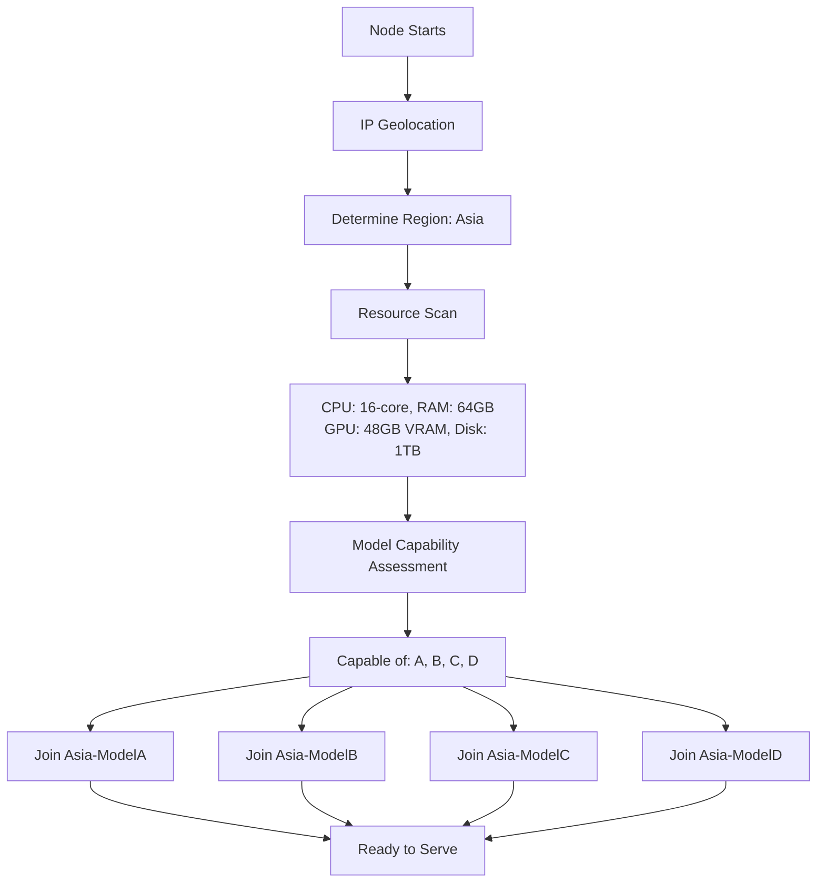

# OpenGateway Architecture Requirements

## Overview

OpenGateway is a fully decentralized, peer-to-peer AI inference network built on top of [EXO](https://github.com/exo-explore) that enables geographic and resource-based clustering for efficient AI model distribution and inference.

## Core Architecture

### 1. Geographic-Based Clustering

**Requirement**: All nodes must be organized into geographic regions based on their IP address.

**Supported Regions**:
- Asia
- North America
- Europe
- Africa
- South America
- Oceania
- Middle East

**Implementation**:
- Use IP-based geolocation to automatically determine node region
- Each region operates as an independent network segment
- Regional isolation reduces latency and improves inference speed

**Scope**:
- **Phase 1** (Current): Focus on regional clustering only
- **Phase 2** (Future): Cross-region fallback when local capacity is exhausted

---

### 2. Resource-Based Model Clusters

**Requirement**: Within each geographic region, nodes are organized into model-specific clusters based on their hardware capabilities.

#### 2.1 Resource Classification

Each node joining the network must be profiled for:
- **CPU**: Core count, architecture, clock speed
- **GPU**: VRAM capacity, compute capability, model
- **RAM**: Total system memory
- **Disk**: Available storage for model weights

#### 2.2 Model Cluster Tiers

Nodes are assigned to model clusters based on their resource capabilities:

| Cluster | Model Example | CPU | RAM | GPU VRAM | Disk |
|---------|--------------|-----|-----|----------|------|
| **Model A** | Llama 3.1 8B, Phi-3 Mini | 4+ cores | 8GB+ | Optional | 20GB+ |
| **Model B** | Mistral 7B, Gemma 7B | 4+ cores | 12GB+ | 8GB+ (recommended) | 30GB+ |
| **Model C** | Llama 3.1 70B, Mixtral 8x7B | 8+ cores | 32GB+ | 24GB+ | 150GB+ |
| **Model D** | DeepSeek V3, Llama 3.1 405B | 16+ cores | 64GB+ | 48GB+ | 500GB+ |

*Note: These are initial estimates and will be refined based on actual EXO performance benchmarks.*

#### 2.3 Multi-Cluster Participation

**Requirement**: A powerful node MUST join ALL clusters it qualifies for.

**Rationale**:
- Maximizes network capacity utilization
- Provides flexibility for load balancing
- Allows nodes to serve multiple model types

**Example**:
```
PC1 Resources: 16-core CPU, 64GB RAM, 48GB VRAM, 1TB disk
→ Qualifies for: Model A, Model B, Model C, Model D
→ Joins: Asia-ModelA, Asia-ModelB, Asia-ModelC, Asia-ModelD
```

---

### 3. Cluster Topology

**Hierarchical Structure**:
```
Global Network
│
├── Asia Region
│   ├── Model A Cluster (100+ nodes)
│   ├── Model B Cluster (50+ nodes)
│   ├── Model C Cluster (20+ nodes)
│   └── Model D Cluster (10+ nodes)
│
├── North America Region
│   ├── Model A Cluster
│   ├── Model B Cluster
│   ├── Model C Cluster
│   └── Model D Cluster
│
└── Europe Region
    ├── Model A Cluster
    ├── Model B Cluster
    ├── Model C Cluster
    └── Model D Cluster
```

**Key Characteristics**:
- Each region-model pair is an independent EXO cluster
- Clusters within a region do NOT communicate by default (Phase 1)
- Nodes can be members of multiple clusters simultaneously

---

### 4. Node Onboarding Flow

**Step-by-Step Process**:



**Concrete Example**:

**Scenario**: PC1 in Manila, Philippines

1. **Startup**: PC1 runs OpenGateway node software
2. **Geolocation**: IP `203.177.x.x` → Detected as **Asia** region
3. **Resource Detection**:
   - CPU: AMD Ryzen 9 5950X (16 cores)
   - RAM: 64GB DDR4
   - GPU: NVIDIA RTX 4090 (24GB VRAM)
   - Disk: 1TB NVMe SSD
4. **Capability Matching**:
   - ✅ Model A: Qualified (exceeds requirements)
   - ✅ Model B: Qualified (exceeds requirements)
   - ✅ Model C: Qualified (meets requirements)
   - ❌ Model D: Not qualified (needs 48GB VRAM, has 24GB)
5. **Cluster Assignment**:
   - Joins: `Asia-ModelA`, `Asia-ModelB`, `Asia-ModelC`
   - Does NOT join: `Asia-ModelD`
6. **Ready**: PC1 can now serve inference requests for Models A, B, and C within Asia

---

### 5. Technology Stack

#### 5.1 EXO Framework

**Purpose**: Handles peer-to-peer clustering, model splitting, and distributed inference.

**Integration Points**:
- Each region-model cluster runs as an independent EXO instance
- EXO handles:
  - Peer discovery within cluster
  - Model weight distribution
  - Inference job splitting across nodes
  - Load balancing within cluster
  - Fault tolerance and node failover

**EXO Capabilities Leveraged**:
- Run frontier AI models locally across distributed nodes
- Dynamic model sharding based on available resources
- Automatic workload distribution
- Support for multiple ML frameworks (MLX, PyTorch, etc.)

#### 5.2 Network Layer

**Requirements**:
- Peer-to-peer communication (no central servers)
- Efficient model weight sharing (BitTorrent-style or IPFS)
- Low-latency regional routing
- NAT traversal for home networks

---

### 6. Request Routing Architecture

**Phase 1 Requirements** (Regional Only):

```
User Request (Asia) → Asia Region Gateway
                      ↓
                   Model Selection (e.g., ModelB)
                      ↓
                   Asia-ModelB Cluster
                      ↓
                   Load Balance Across Nodes
                      ↓
                   Return Inference Result
```

**Request Routing Logic**:
1. User submits request (with model preference or auto-select)
2. Determine user's region via IP
3. Route to appropriate regional model cluster
4. If cluster at capacity → Queue request (Phase 1)
5. If cluster unavailable → Return error (Phase 1)

**Phase 2 Enhancements** (Future):
- Cross-region fallback routing
- Global load balancing
- Smart routing based on latency/availability

---

### 7. Bootstrap and Discovery

**Bootstrap Nodes**:
- Each region maintains a list of bootstrap nodes
- Bootstrap nodes help new nodes discover cluster peers
- Bootstrap nodes are community-operated (decentralized)

**Peer Discovery**:
- DHT (Distributed Hash Table) for peer lookup
- Gossip protocol for cluster membership updates
- Heartbeat mechanism for node health monitoring

Discovery is **peer-to-peer** (no central directory); nodes can join from any location using an open-source stack. **Full specification**: [architecture/DISCOVERY.md](./architecture/DISCOVERY.md).

*(Options table and detailed recommendation: [architecture/DISCOVERY.md](./architecture/DISCOVERY.md).)*

---

### 8. Token Economy and Security

**Note**: The complete token economy system and security architecture has been moved to a dedicated document for better organization.

**See**: [`architecture/TOKEN_ARCHITECTURE.md`](./architecture/TOKEN_ARCHITECTURE.md)

**Summary**:
- **Token-based economy**: Zero-sum system where tokens spent = tokens earned
- **Contribute-to-use model**: Must contribute compute to earn tokens to make requests
- **Minimum balance**: 1,000 tokens required to make requests
- **Overdraft protection**: Requests complete even if balance goes negative
- **Security**: Cryptographic proofs + reputation system + hardware fingerprinting
- **Debt persistence**: Hardware-bound accounts prevent debt evasion via reinstall

**Key Features**:
- Real-time token distribution based on actual compute contribution
- Distributed ledger with gossip protocol synchronization
- Reputation-based fraud detection and slashing
- Machine identity via hardware fingerprinting
- No blockchain required - fast and scalable

For complete details on token cost calculation, distribution methods, security architecture, fraud detection, reputation system, and machine identity, see the dedicated TOKEN_ARCHITECTURE.md document.

---

### 10. Out of Scope (Future Work)

**Phase 2 Features**:
- ❌ Cross-region fallback routing
- ❌ Global load balancing
- ❌ Model fine-tuning on network
- ❌ On-chain verification/incentives
- ❌ Advanced reputation system
- ❌ Model weight caching strategies
- ❌ Spot/priority request tiers

**Current Focus**:
- ✅ Regional clustering
- ✅ Resource-based model assignment
- ✅ Multi-cluster participation
- ✅ Basic peer-to-peer inference using EXO

---

## Design Decisions

### Why Geographic Clustering?

**Benefits**:
- Reduced latency (requests stay local)
- Improved throughput (local bandwidth)
- Simpler initial implementation
- Natural sharding of global load

**Trade-offs**:
- No cross-region redundancy (Phase 1)
- Uneven capacity distribution across regions
- Potential for regional outages

**Decision**: Start with geographic isolation, add cross-region in Phase 2.

---

### Why Multi-Cluster Participation?

**Benefits**:
- Better resource utilization
- Increased network flexibility
- Higher availability per model
- Simpler load balancing

**Trade-offs**:
- Node must store multiple model weights
- More complex node management
- Potential resource contention

**Decision**: Mandate multi-cluster participation to maximize capacity.

---

### Why EXO?

**Rationale**:
- Purpose-built for distributed AI inference
- Proven peer-to-peer architecture
- Active development and community
- Supports multiple frameworks and hardware
- Handles model splitting automatically

**Alternative Considered**:
- Custom P2P solution: Too complex, reinventing wheel
- Ray/Dask: Not designed for adversarial/untrusted nodes
- IPFS + Custom: Missing inference orchestration

**Decision**: Build on EXO's proven foundation.

---

## Related Architecture Documents

For detailed architecture on specific subsystems, see:

- **[architecture/TOKEN_ARCHITECTURE.md](./architecture/TOKEN_ARCHITECTURE.md)** - Complete token economy and security
- **[architecture/PROOF_SYSTEM.md](./architecture/PROOF_SYSTEM.md)** - Cryptographic proof system details
- **[architecture/ONBOARDING_NODES.md](./architecture/ONBOARDING_NODES.md)** - Node installation and CLI
- **[architecture/README.md](./architecture/README.md)** - Architecture documentation index

---

## Next Steps

1. **Define exact resource thresholds** for each model tier based on EXO benchmarks
2. **Design bootstrap node discovery** mechanism per region
3. **Implement resource profiling** tool for node classification
4. **Create cluster membership** protocol (join/leave/heartbeat)
5. **Build request routing** gateway for each region
6. **Develop monitoring** system for cluster health and capacity

---

## Revision History

| Version | Date | Changes |
|---------|------|---------|
| 0.1 | 2026-02-13 | Initial architectural requirements |
