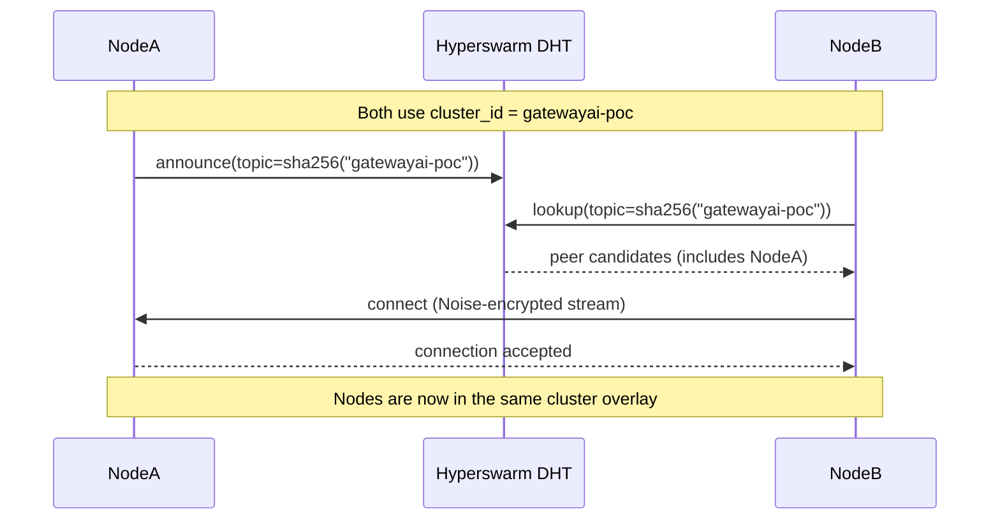
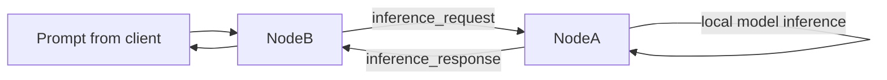

# Cluster Join and P2P Discovery (POC)

This document explains how NodeB joins NodeA in the same cluster in the current POC implementation, and how node discovery works in the P2P setup.

## Current POC behavior

- Nodes join the same cluster by using the same `cluster_id` (for example, `gatewayai-poc`).
- In the current running code, discovery is handled by **Hyperswarm** (DHT-based P2P discovery).
- Both nodes hash the cluster ID to the same topic and announce/lookup on that topic.
- Matching topic membership leads to peer candidate discovery and direct encrypted peer connections.

## Steps: NodeB joins NodeA

1. Run install on NodeB (same version as NodeA).
2. Connect NodeB to the same cluster:
   - `opengateway connect gatewayai-poc`
3. Start NodeB:
   - `opengateway start` (or `opengateway restart`)
4. NodeA and NodeB join `sha256("gatewayai-poc")` in Hyperswarm.
5. DHT returns peer candidates, and the nodes connect.

## Sequence diagram: join + discovery



## Topology diagram

```mermaid
graph TD
    T[Topic: sha256(gatewayai-poc)]
    A[NodeA]
    B[NodeB]
    C[NodeC]

    A --> T
    B --> T
    C --> T

    A <-->|peer connection| B
    B <-->|peer connection| C
    A <-->|peer connection| C
```

## Message path after discovery



## Note on EXO vs current POC

- Architecture docs discuss EXO and broader discovery options.
- Current POC runtime path for discovery and cluster membership is Hyperswarm.
- If EXO is introduced later in runtime, this flow can be extended to show EXO-specific cluster orchestration.
